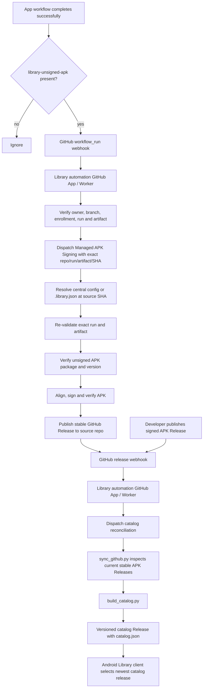

# Library

[](https://github.com/c0di-org/library/actions/workflows/android.yml)

**Apps, without the mall.**

Library is an Android app store backed by GitHub Releases. It discovers installable APKs, verifies their package/version/hash/signing identity, and supports both developer-signed releases and Library-managed signing for apps that intentionally publish unsigned CI artifacts.

<p align="center">
  
  
</p>

## How updates work

Library is event-driven. The automation GitHub App receives GitHub webhooks and dispatches narrowly scoped workflows; it does not poll repositories for the latest unsigned build.



The important boundaries are:

- **Workflow webhook selection:** the Worker only dispatches managed signing for successful non-PR runs in the configured source owner, on the allowed branch, with the expected unexpired artifact.
- **Exact-artifact signing:** the protected signing workflow receives the source repository, workflow run ID, artifact ID, and commit SHA. The signer re-fetches and verifies that exact run/artifact before touching the distribution key. There is no "find the latest artifact" fallback.
- **Release-driven catalog updates:** publishing a signed release emits a normal GitHub Release webhook. Catalog reconciliation rebuilds from GitHub Releases and publishes a new `catalog-<run-id>-<attempt>` release containing `catalog.json`.
- **No catalog recursion:** the Worker entrypoint ignores Library's own `catalog` and `catalog-*` release events, and `catalog.yml` has an independent self-release guard.
- **Recovery reconciliation:** `catalog.yml` also has a six-hour schedule as a safety net for missed release webhooks. It does not perform managed signing.

## Features

- Public and private GitHub repositories
- Install and update APKs
- Search, app details, release notes, and source links
- Verifies package, version, APK SHA-256, and signer
- Event-driven Library-managed signing for intentionally unsigned CI artifacts
- Independent versioned catalog releases with a bundled offline fallback

## Add an app

### Developer-signed

Publish a stable GitHub Release containing a standalone signed `.apk`. A Release webhook triggers catalog reconciliation automatically.

### Library-managed

Have the app's normal/default-branch release workflow upload exactly one unsigned APK in an Actions artifact named `library-unsigned-apk`, then declare enrollment in the app repository's `.library.json`:

```json
{
  "provenance": "library-managed",
  "managedSigning": {
    "packageName": "org.c0di.example",
    "tagPrefix": "android-v"
  }
}
```

For repositories owned by the configured source owner, repo-side enrollment is enough. `config/managed-apps.json` is available when Library needs to centrally pin the package, branch, artifact name, or other enrollment details.

Do not add a polling workflow to an app repository. The automation GitHub App watches completed workflows across its installation and dispatches signing only when the expected artifact is present.

Optional storefront metadata also lives in `.library.json`.

## Build

```bash
python3 scripts/build_catalog.py
./gradlew assembleDebug
```

## Automation components

- `infra/catalog-webhook/` — verifies GitHub webhooks, checks candidate artifacts, prevents catalog-release feedback loops, and dispatches Library workflows.
- `.github/workflows/managed-signing.yml` — protected entry point for one exact source artifact.
- `scripts/resolve_managed_app.py` — resolves central or repository-side enrollment for the exact source commit.
- `scripts/manage_unsigned_apks.py` — re-validates, signs, verifies, and publishes the exact artifact selected by the webhook.
- `.github/workflows/catalog.yml` — full catalog reconciliation and versioned catalog release publication, plus the periodic recovery safety net.
- `scripts/sync_github.py` — authoritative filter for installable GitHub APK releases.

## Docs

[Releases](docs/RELEASES.md) · [Signing](docs/SIGNING.md) · [GitHub App](docs/GITHUB_APP.md) · [Architecture](docs/ARCHITECTURE.md) · [Webhook automation](infra/catalog-webhook/README.md)
